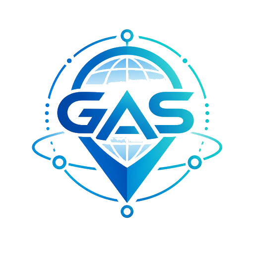

# Geospatial Agentic Services (GAS)

[](LICENSE)
[](pyproject.toml)
[](https://pypi.org/project/gas-client/)
[](http://geospatial-agentic-services.online/registry)
[](https://www.researchgate.net/publication/404738967_Geospatial_Agentic_Services_A_Framework_for_Interoperable_Geospatial_Intelligence)
[](https://giscience.psu.edu/)

This repository provides a reference implementation and developer toolkit for
the Geospatial Agentic Services (GAS) framework. GAS focuses on geospatial
interoperability in the era of autonomous GIS and geospatial AI agents. Its goal
is to make geospatial agents, their capabilities, and workflows easier to
describe, discover, invoke, compose, validate, and reuse across different
platforms.

The main component is a GAS server that publishes geospatial agents as
discoverable web services through standard `GetCapabilities` and
`DescribeAgent` JSON documents. The repository also includes a lightweight
Python client SDK, a GAS Registry web app, example notebooks, developer
documentation, interface schemas, and working reference agent implementations.

The public [GAS Registry](http://geospatial-agentic-services.online/registry)
is a searchable catalog of published GAS agent services. It reads GAS
`GetCapabilities` and `DescribeAgent` documents from registered servers and
helps users, applications, and AI orchestrators discover interoperable
geospatial agents and services.

For the conceptual framework behind this implementation, see the GAS paper:
[Geospatial Agentic Services: A Framework for Interoperable Geospatial
Intelligence](https://www.researchgate.net/publication/404738967_Geospatial_Agentic_Services_A_Framework_for_Interoperable_Geospatial_Intelligence).

## What GAS Is

GAS is an interoperability layer for heterogeneous geospatial agents and
services. It helps clients discover what agents exist, understand what each
agent can do, submit geospatial tasks, monitor execution, retrieve artifacts,
and compose services into larger workflows.

GAS does not prescribe how geospatial agents should be designed, how they
should reason, how their performance should be improved, or how general
agentic systems should be built. It also does not assume that all geospatial
agents must follow one specific architecture, protocol, or implementation
pattern. Instead, GAS focuses on the shared service contracts needed when
different geospatial agents and platforms need to work together.

## What This Repository Includes

- A GAS server framework for publishing geospatial agents as web
  services.
- Standard GAS interface documents and JSON schemas for discovery, agent
  description, task submission, task results, and artifact metadata.
- A lightweight Python client SDK for notebooks, applications, and AI
  orchestrators.
- A GAS Registry web app for indexing and searching published GAS services.
- Reference geospatial agents for retrieval, inspection, analysis, mapping,
  workflow planning, and spatial statistics.
- Example notebooks showing raw HTTP usage, client SDK workflows, streaming,
  distributed services, and multi-agent service chains.
- Developer documentation for adding agents, running the server, hosting
  services, using the registry, and contributing to the codebase.

## Choose Your Path

### Use Published GAS Services

This path is for end users, GIS analysts, notebook users, application
developers, and AI orchestrators that want to discover and invoke existing GAS
services.

Start here:

1. Find services through a GAS server or the public
   [GAS Registry](http://geospatial-agentic-services.online/registry).
2. Inspect the server's `GetCapabilities` document.
3. Inspect an agent's `DescribeAgent` document.
4. Invoke the agent with raw HTTP requests or the `gas-client` SDK.
5. Retrieve returned artifacts such as datasets, maps, reports, or web apps.

Useful links:

- [Quick Start: Use A GAS Service](#quick-start-use-a-gas-service)
- [GAS Client SDK](docs/gas_client_sdk.md)
- [GAS Interfaces](docs/gas_interfaces.md)
- [GAS Registry](docs/gas_registry.md)
- [Included GAS Agents](docs/included_agents.md)
- [Example notebooks](examples_for_using_gas_services)

### Add A Geospatial Agent

This path is for geospatial agent developers, researchers, and teams that want
to publish new geospatial capabilities into the GAS ecosystem.

Start here:

1. Set up the GAS server development environment.
2. Add a `GeoAgent` implementation.
3. Add a small service wrapper.
4. Add a `DescribeAgent` capability JSON document.
5. Run tests and schema validation.
6. Publish the agent through a GAS server and register it if desired.

Useful links:

- [Adding a GAS Agent Service](docs/adding_an_agent_service.md)
- [GAS Server Framework](docs/gas_server_architecture.md)
- [GAS Interfaces](docs/gas_interfaces.md)
- [Included GAS Agents](docs/included_agents.md)
- [Contributing](CONTRIBUTING.md)

### Host A GAS Server

This path is for labs, organizations, platform teams, and developers that want
to operate public or private GAS services.

Start here:

1. Configure the server host, port, and public base URL.
2. Run the GAS server locally.
3. Deploy the Flask app with a production WSGI server.
4. Put the server behind a reverse proxy for TLS, logging, compression, and
   request-size control.
5. Register the server with the GAS Registry if you want its agents to be
   discoverable through the catalog.

Useful links:

- [Quick Start: Run The GAS Server Locally](#quick-start-run-the-gas-server-locally)
- [Development and Deployment Environment](docs/development_and_deployment_environment.md)
- [GAS Server Framework](docs/gas_server_architecture.md)
- [GAS Registry](docs/gas_registry.md)
- [Security](SECURITY.md)

### Improve the Codebase

This path is for contributors working on the GAS server framework, GAS
Registry, client SDK, schemas, examples, tests, or documentation.

Start here:

1. Set up a local development environment.
2. Review the server, registry, client, and schema documentation.
3. Run the test suite.
4. Keep changes focused and aligned with the existing service contracts.
5. Follow the contribution, security, and repository hygiene guidance.

Useful links:

- [Contributing](CONTRIBUTING.md)
- [GAS Server Framework](docs/gas_server_architecture.md)
- [GAS Client SDK](docs/gas_client_sdk.md)
- [GAS Registry](docs/gas_registry.md)
- [GAS Interfaces](docs/gas_interfaces.md)
- [Security](SECURITY.md)

## Quick Start: Use A GAS Service

Install the published client SDK:

```powershell
python -m pip install gas-client
```

Call a GAS service:

```python
from gas_client import GasClient

client = GasClient("https://your-gas-server.com")

print(client.list_agents())

agent = client.agent("geospatial_data_retrieval_agent")
result = agent.execute_task(
    "Download Pennsylvania county boundaries from Census Bureau.",
    mode="sync",
    credentials={"OPENAI_API_KEY": "YOUR_OPENAI_API_KEY"},
)

client.print_task_summary(result)
print(client.get_artifact_urls(result))
```

Credential requirements are defined by each service's `DescribeAgent`
capability document. One service may require an OpenAI key, another may use a
different model provider, another may require data-source credentials, and a
deterministic service may not need an LLM key at all.

For streaming tasks:

```python
for event in agent.execute_task(
    "Download Pennsylvania county boundaries from Census Bureau.",
    mode="stream",
):
    client.print_stream_event(event)
    if event.get("event") == "task_result":
        result = event.get("payload")

client.print_task_summary(result)
```

See [docs/gas_client_sdk.md](docs/gas_client_sdk.md) for the full SDK guide.
The standalone package README is in
[packages/gas-client/README.md](packages/gas-client/README.md).

Useful links:

- [GAS Client SDK](docs/gas_client_sdk.md)
- [GAS Interfaces](docs/gas_interfaces.md)
- [GAS Registry](docs/gas_registry.md)
- [Included GAS Agents](docs/included_agents.md)
- [Example notebooks](examples_for_using_gas_services)
- [Raw HTTP example notebook](examples_for_using_gas_services/gas_raw_requests_usage.ipynb)
- [Streaming examples notebook](examples_for_using_gas_services/agents_streaming_examples.ipynb)

## Quick Start: Run The GAS Server Locally

Install project dependencies in your development environment, then start the
server:

```powershell
python -m gas_server.entrypoints.gas_server
```

In local development, this implementation uses port `4042` by default. A GAS
server host can change the host, port, and public base URL for deployment.
Registered agents are published under the configured server URL:

```text
http://127.0.0.1:4042/agents/{agent_id}
```

Get the server-level capability document:

```text
http://127.0.0.1:4042/?SERVICE=GAS&VERSION=1.0.0&REQUEST=GetCapabilities
```

Describe one agent:

```text
http://127.0.0.1:4042/?SERVICE=GAS&VERSION=1.0.0&REQUEST=DescribeAgent&agent_id=mapping_agent
```

Common agent operations include:

- `/status`
- `/tasks` with `task.mode` set to `sync`, `async`, or `stream`
- `/tasks/<task_id>/status`
- `/tasks/<task_id>/result`
- `/tasks/<task_id>/cancel`
- `/data/<filename>`

See
[docs/development_and_deployment_environment.md](docs/development_and_deployment_environment.md)
for local development setup, VS Code workflow, ngrok demos, resource planning,
and production hosting guidance.

Useful links:

- [Development and Deployment Environment](docs/development_and_deployment_environment.md)
- [GAS Server Framework](docs/gas_server_architecture.md)
- [GAS Interfaces](docs/gas_interfaces.md)
- [Adding a GAS Agent Service](docs/adding_an_agent_service.md)
- [Included GAS Agents](docs/included_agents.md)
- [Security](SECURITY.md)

## Quick Start: Run The GAS Registry Locally

The GAS Registry is a lightweight Flask catalog app for discovering published
GAS agent services across one or more GAS servers. It reads standard
`GetCapabilities` and `DescribeAgent` documents, stores agent descriptions in a
searchable catalog, and helps people, applications, and AI orchestrators
inspect, compare, and reuse interoperable geospatial agents.

Run the registry locally:

```powershell
python -m gas_registry.app
```

In local development, the registry uses port `4043` by default:

```text
http://127.0.0.1:4043/registry
```

See [docs/gas_registry.md](docs/gas_registry.md) for UI details, developer and
AI agent API access, public `GET` endpoints for listing and searching agents,
admin-token-protected write endpoints, the UI token flow, and deployment notes.

Useful links:

- [GAS Registry](docs/gas_registry.md)
- [Development and Deployment Environment](docs/development_and_deployment_environment.md)
- [GAS Interfaces](docs/gas_interfaces.md)
- [GAS Client SDK](docs/gas_client_sdk.md)
- [Included GAS Agents](docs/included_agents.md)
- [Security](SECURITY.md)

## Add A New Geospatial Agentic Service

Adding a new agent is plugin-style. In the common case, you add three files:

```text
gas_server/agents/my_new_agent.py
gas_server/services/my_new_agent_service.py
gas_server/capabilities/my_new_agent.json
```

The agent implementation should inherit from `GeoAgent` and implement the
standard `run()` method. The service wrapper should stay small, and the
capability JSON should describe the agent's inputs, outputs, credentials,
parameters, task modes, artifacts, and examples.

Progress events are recommended for long-running agents, especially agents
that perform LLM calls, code execution, large geospatial file processing, or
remote downloads. Credential requirements are agent-specific and should be
documented in each agent's `DescribeAgent` capability JSON.

See [docs/adding_an_agent_service.md](docs/adding_an_agent_service.md) for the
full workflow, code templates, capability JSON requirements, request payload
examples, credential design, testing guidance, and production deployment notes.

Useful links:

- [Adding a GAS Agent Service](docs/adding_an_agent_service.md)
- [Development and Deployment Environment](docs/development_and_deployment_environment.md)
- [GAS Server Framework](docs/gas_server_architecture.md)
- [GAS Interfaces](docs/gas_interfaces.md)
- [Included GAS Agents](docs/included_agents.md)
- [Contributing](CONTRIBUTING.md)

## Included Agents

The [included agents](docs/included_agents.md) demonstrate how geospatial
workflows such as data retrieval, workflow planning, mapping, raster analysis,
vector analysis, data inspection, conflict-event preprocessing, and spatial
statistics can be exposed as interoperable GAS services. These agents are
provided as reference examples, not as a prescribed model for how all
geospatial agents should be implemented.

The included catalog covers:

- Geospatial data retrieval
- USGS earthquake data
- PASDA discovery
- Geospatial data inspection
- Exploratory spatial data analysis
- Geospatial workflow planning
- Spatiotemporal conflict event layer generation
- Vector analysis
- Raster analysis
- Spatial analysis
- Map projection
- Static mapping
- Web mapping app generation
- Spatial statistics

See [docs/included_agents.md](docs/included_agents.md) for details and
guidance on choosing an example to follow.

## HTML Documentation Site

This repository can publish the Markdown documentation as a searchable HTML
site with MkDocs Material. The source files remain in [docs](docs), and the
generated `site/` folder is ignored by Git.

Build the documentation locally:

```powershell
python -m pip install -e .[docs]
python -m mkdocs build --strict
```

Preview the site locally:

```powershell
python -m mkdocs serve
```

The GitHub Actions workflow in
[.github/workflows/docs.yml](.github/workflows/docs.yml) builds and publishes
the site to GitHub Pages when changes are pushed to `main`.

## Documentation Guide

| Document | Purpose |
| --- | --- |
| [docs/adding_an_agent_service.md](docs/adding_an_agent_service.md) | Full workflow for adding and publishing a new GAS agent service. |
| [docs/gas_server_architecture.md](docs/gas_server_architecture.md) | Server architecture, service-oriented design, request flow, folders, credentials, and artifacts. |
| [docs/gas_interfaces.md](docs/gas_interfaces.md) | GAS JSON interfaces for discovery, agent description, task requests, responses, and artifact metadata. |
| [docs/gas_client_sdk.md](docs/gas_client_sdk.md) | Python client SDK usage, task modes, artifacts, streaming, and service chaining. |
| [docs/gas_registry.md](docs/gas_registry.md) | Registry UI, local run instructions, API endpoints, registration flow, and deployment notes. |
| [docs/development_and_deployment_environment.md](docs/development_and_deployment_environment.md) | Local development, VS Code workflow, ngrok demos, hosting options, and resource planning. |
| [docs/included_agents.md](docs/included_agents.md) | Catalog of included agents and the implementation patterns they demonstrate. |
| [CONTRIBUTING.md](CONTRIBUTING.md) | Development setup, contribution workflow, tests, secrets, and generated file guidance. |
| [SECURITY.md](SECURITY.md) | Supported versions, secret handling, and vulnerability reporting guidance. |

## Example Notebooks

Example workflows are available in
[examples_for_using_gas_services](examples_for_using_gas_services). These
notebooks demonstrate the capabilities of the included agents and show how
geospatial agents with different capabilities, hosted on distributed GAS
servers, can be published as interoperable services, described, discovered,
invoked, and composed into reproducible geospatial workflows.

The examples cover raw HTTP requests, client SDK workflows, streamed execution,
multi-agent chains, distributed services, artifact reuse, and a browser-based
workflow planning app.

- [gas_raw_requests_usage.ipynb](examples_for_using_gas_services/gas_raw_requests_usage.ipynb)
  demonstrates the GAS HTTP interface directly with `requests`.
- [county_population_choropleth_workflow.ipynb](examples_for_using_gas_services/county_population_choropleth_workflow.ipynb)
  uses `GasClient` to retrieve county population data, project it, and create a
  quantile choropleth map.
- [cdc_earthquake_vector_mapping_workflow.ipynb](examples_for_using_gas_services/cdc_earthquake_vector_mapping_workflow.ipynb)
  combines CDC PLACES health data and recent USGS earthquake events.
- [pa_health_food_hospitals_web_mapping_app_workflow.ipynb](examples_for_using_gas_services/pa_health_food_hospitals_web_mapping_app_workflow.ipynb)
  downloads Pennsylvania health, boundary, restaurant, and hospital datasets
  and builds a browser-ready web mapping app.
- [pa_hospital_accessibility_multi_download_workflow.ipynb](examples_for_using_gas_services/pa_hospital_accessibility_multi_download_workflow.ipynb)
  demonstrates one retrieval request that downloads multiple datasets for
  downstream analysis.
- [raster_agent_dem_workflow.ipynb](examples_for_using_gas_services/raster_agent_dem_workflow.ipynb)
  uses `raster_agent` to generate raster outputs from DEM data.
- [county_obesity_hotspot_analysis_workflow.ipynb](examples_for_using_gas_services/county_obesity_hotspot_analysis_workflow.ipynb)
  chains data retrieval with spatial statistics for hotspot analysis.
- [county_obesity_hotspot_analysis_workflow2.ipynb](examples_for_using_gas_services/county_obesity_hotspot_analysis_workflow2.ipynb)
  provides a second obesity hotspot workflow variant.
- [geospatial_workflow_planning_agent_demo.ipynb](examples_for_using_gas_services/geospatial_workflow_planning_agent_demo.ipynb)
  demonstrates the plan-only workflow planning agent.
- [hospital_mapping_with_distributed_agents_and_multiple_request_modes.ipynb](examples_for_using_gas_services/hospital_mapping_with_distributed_agents_and_multiple_request_modes.ipynb)
  shows a distributed GAS service chain across two GAS servers.
- [agents_streaming_examples.ipynb](examples_for_using_gas_services/agents_streaming_examples.ipynb)
  exercises published GAS agents with streamed calls.

The folder also includes
[geospatial_workflow_planning_agent_app.html](examples_for_using_gas_services/geospatial_workflow_planning_agent_app.html),
a browser-based web app developed around the `geospatial_workflow_planning_agent`.

## Testing

Run the test suite:

```powershell
.\.venv\Scripts\python.exe -m pytest
```

The tests cover service contracts, schema validation, agent behavior, task
execution paths, client behavior, and registry behavior.

## Repository Hygiene

Use `.env.example` as a safe template for local environment variables. Do not
commit real API keys, downloaded datasets, generated outputs, build artifacts,
or notebook execution outputs.

The root `.gitignore` excludes common local folders used by this repository,
including `Data/`, `Output/`, `cache/`, test scratch folders, virtual
environments, and Python build artifacts.

## Production Deployment

For production, run the Flask app with a WSGI server such as Waitress on
Windows or Gunicorn on Linux, and place it behind a reverse proxy for TLS,
logging, compression, and request-size control.

See
[docs/development_and_deployment_environment.md](docs/development_and_deployment_environment.md)
for deployment details, hosting options, operational tips, and server resource
planning.

## Acknowledgments

We thank the coauthors of the paper
[Geospatial Agentic Services: A Framework for Interoperable Geospatial
Intelligence](https://www.researchgate.net/publication/404738967_Geospatial_Agentic_Services_A_Framework_for_Interoperable_Geospatial_Intelligence)
for their contributions to the development of the broader GAS concepts.

We welcome contributions from the broader geospatial community to advance both
the GAS framework and its reference implementation, including but not limited
to use cases, interoperability models, validation methods, documentation,
software components, registries, and GAS-compatible agent services.

[Geoinformation and Big Data Research Laboratory
(GIBD)](https://giscience.psu.edu/), Department of Geography, Penn State.

## License

This repository is released under the MIT License. See [LICENSE](LICENSE).

<p align="center">
  
</p>
