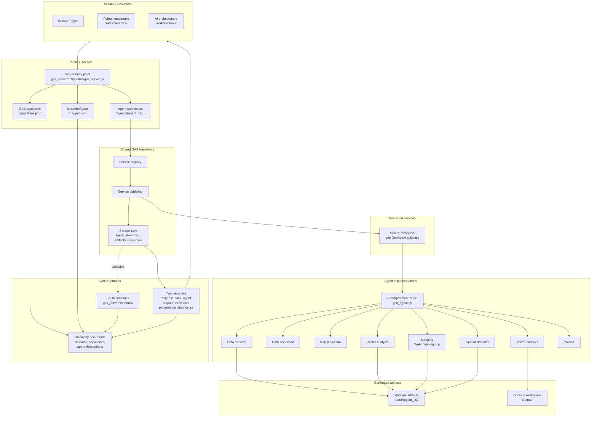

# GAS Server Framework

This repository is an implementation of the server component of the
Geospatial Agentic Services (GAS) framework. It publishes geospatial agents as
web services and provides the shared server framework for discovery,
task execution, streaming progress, artifact delivery, and standard response
normalization.

The repository also includes the GAS Registry, a lightweight catalog web app
for indexing `GetCapabilities` and `DescribeAgent` documents from one or more
GAS servers. The public registry is available at
[http://geospatial-agentic-services.online/registry](http://geospatial-agentic-services.online/registry),
and the local implementation is documented in [gas_registry.md](gas_registry.md).

One important design goal is plugin-style extension: a developer should be able
to add a new geospatial agent by adding a small number of files, without
editing the shared code files.

This implementation is designed to reflect the service-oriented GAS concepts
described in the paper [Geospatial Agentic Services: A Framework for
Interoperable Geospatial
Intelligence](https://www.researchgate.net/publication/404738967_Geospatial_Agentic_Services_A_Framework_for_Interoperable_Geospatial_Intelligence).
Readers who want the broader motivation, terminology, and interoperability
model should refer to that paper alongside this developer documentation.

## Architecture Diagram

The diagram below shows how the codebase is organized around service
discovery, the shared GAS server framework, plugin-style agent publication, and
standard task responses.



## Service-Oriented Architecture

The GAS server follows a service-oriented architecture (SOA). Each geospatial
agent is treated as an individual service with its own public capability
description, service route, status endpoint, task endpoint, streaming mode,
and artifact endpoint.

All agent services are hosted by one GAS server process in this implementation.
They share the server's configured external port, but each agent has its own
route namespace:

```text
/agents/{agent_id}/status
/agents/{agent_id}/tasks
/agents/{agent_id}/tasks/{task_id}/status
/agents/{agent_id}/tasks/{task_id}/result
/agents/{agent_id}/tasks/{task_id}/cancel
/agents/{agent_id}/data/{filename}
```

This means the server behaves like a catalog and gateway for multiple
geospatial web services. A browser, Python client, or AI orchestrator discovers
available services through `GetCapabilities`, reads each service through
`DescribeAgent`, and then calls the selected agent service.

## Folder Structure

```text
gas_server/
  agents/
  services/
  capabilities/
  schemas/
  core/
  entrypoints/
  static/

gas_client/
gas_registry/
docs/
Data/
Output/
tests/
```

### `gas_server/agents`

This folder contains the actual agent implementations. Each agent is a Python
class that inherits from `GeoAgent`.

For example:

```text
gas_server/agents/web_mapping_app_agent.py
gas_server/agents/spatial_statistics_agent.py
gas_server/agents/geospatial_data_retrieval_agent.py
```

Agent files contain the domain logic: geospatial analysis, data retrieval,
mapping, PySAL modeling, LLM-guided code generation, validation, report
generation, and artifact creation.

New agent developers normally implement:

```python
def run(self, query, input_dataset_paths=None, progress_callback=None):
    ...
```

Developers should not implement `run_service()` in agent files. The base
`GeoAgent` class provides `run_service()` as the shared service adapter.

### `gas_server/services`

This folder contains one small publication wrapper per agent. The service file
is intentionally tiny. Its job is to publish an agent class as a GAS service.

For example:

```text
gas_server/services/web_mapping_app_agent_service.py
```

Each service file imports the agent class and registers it:

```python
from gas_server.core.agent_registration import register_geo_agent
from gas_server.agents.my_new_agent import MyNewAgent

REGISTRATION = register_geo_agent(MyNewAgent, __name__)
```

Everything below that registration line is standard lazy publication code. New
agent developers should usually copy an existing service file and change only
the import and registration line.

### `gas_server/capabilities`

This folder contains the public service descriptions.

```text
gas_server/capabilities/capabilities.json
gas_server/capabilities/web_mapping_app_agent.json
gas_server/capabilities/spatial_statistics_agent.json
```

`capabilities.json` is the server-level capability document. It helps
clients discover the available agent services.

Each `{agent_id}.json` file is a `DescribeAgent` document. It describes one
agent service, including:

- profile
- default model
- skills
- inputs
- outputs
- ExecuteTask request/response schema links
- credentials
- conformance
- provenance and reproducibility
- governance
- extensions

Shared operations such as `ExecuteTask`, `GetTaskStatus`, `GetTaskResult`, and
`CancelTask` are advertised once in `GetCapabilities`. `DescribeAgent` focuses
on what the selected agent expects and returns through `execute_task`.

In the GAS design, these documents are important interoperability artifacts. A
client or AI orchestrator should be able to inspect a `DescribeAgent` document
and decide whether the agent is suitable for a task.

For a focused explanation of the JSON interfaces, see
[gas_interfaces.md](gas_interfaces.md).

For a catalog of the included example agents, see
[included_agents.md](included_agents.md).

For local development, ngrok demos, resource planning, and production hosting,
see [development_and_deployment_environment.md](development_and_deployment_environment.md).

### `gas_server/schemas`

This folder contains JSON Schemas for public GAS documents.

```text
gas_server/schemas/capabilities.schema.json
gas_server/schemas/describe_agent.schema.json
gas_server/schemas/execute_task_request.schema.json
gas_server/schemas/task_response.schema.json
```

The tests validate capability documents and standard task responses against
these schemas. This supports the longer-term goal of making GAS documents more
standard-like and easier to validate across implementations.

### `gas_server/core`

This folder contains the shared framework used by every agent service. Agent
developers should understand the main ideas, but they usually do not edit these
files when adding a new agent.

Important files:

```text
geo_agent.py
service_registry.py
service_publisher.py
service_core.py
specs.py
llm_client.py
config.py
artifact_inspection.py
file_naming.py
```

`geo_agent.py` defines the base `GeoAgent` class. This is the most important
framework file for agent developers. It defines the standard OOP interface,
progress callback helper, metrics helpers, request parameter handling, and
result helpers.

`service_registry.py` discovers plugin-style service wrappers and turns them
into registered services.

`service_publisher.py` creates the Flask service app for a registered agent.

`service_core.py` is the shared HTTP/GAS service engine. It handles request
parsing, input dataset materialization, synchronous calls, streaming calls,
async task storage, artifact delivery, and standard response normalization.
Agent developers usually do not edit this file.

`llm_client.py` provides the OpenAI-compatible credential adapter used by the
built-in example agents. New agent developers are free to use a different model
provider, a local/open-source model, a deployment-provided credential, or a
fully deterministic workflow.

`config.py` defines runtime paths and server settings.

### `gas_server/entrypoints`

This folder contains the executable GAS server entrypoint.

```text
python -m gas_server.entrypoints.gas_server
```

The entrypoint loads all registered services and publishes them through one
external Flask server.

### `gas_client`

This folder contains a lightweight Python client for GAS. It can:

- read `GetCapabilities`
- read `DescribeAgent`
- call synchronous agent services
- stream progress events
- submit async tasks
- poll task results
- encode local files as input datasets

The client is useful for testing the server and for showing how external users
or AI orchestrators can consume GAS services.

### `gas_registry`

This folder contains the GAS Registry web app. It is a companion catalog
application that reads GAS capability documents from published GAS servers,
stores agent descriptions in SQLite, and presents them as searchable cards or
list rows. It supports discovery across multiple GAS servers without executing
agent tasks itself.

The registry exposes its own discovery-style API under:

```text
/registry/api/gas
```

It also links users back to the original `DescribeAgent` document on the source
GAS server. See [gas_registry.md](gas_registry.md) for run commands and API
examples.

### `Data` and `Output`

These folders are runtime folders, not source folders.

`Data/{agent_id}` stores generated or downloaded service artifacts for each
agent. The server creates these folders automatically from capability document
names.

`Output` is available for shared output needs.

## Plugin-Style Agent Addition

Adding a new agent normally means adding three files:

```text
gas_server/agents/my_new_agent.py
gas_server/services/my_new_agent_service.py
gas_server/capabilities/my_new_agent.json
```

The same `agent_id` should be used everywhere:

```text
my_new_agent
```

That ID should appear in:

- the agent class: `agent_id = "my_new_agent"`
- the service file name: `my_new_agent_service.py`
- the capability file name: `my_new_agent.json`
- the public route: `/agents/my_new_agent/...`
- the runtime folder: `Data/my_new_agent`

There is no separate service key. The `agent_id` is the public service identity.

## How Discovery Works

At startup, the server imports every module in `gas_server/services` whose file
name ends with:

```text
_agent_service.py
```

Each service module must define:

```python
REGISTRATION = register_geo_agent(MyAgent, __name__)
```

The registry uses this registration to discover:

- the agent ID
- the agent class
- whether input datasets are required
- how to build an agent instance
- how to create the service routes
- which capability document belongs to the service

Because of this design, adding a new service does not require editing a central
registry list.

## Request Flow

A typical synchronous request follows this path:

```text
Client
  -> /agents/{agent_id}/tasks with task.mode = "sync"
  -> GAS server entrypoint
  -> registered internal agent service app
  -> shared service_core request parser
  -> input_datasets materialized as local files
  -> fresh GeoAgent instance created
  -> request-time credentials and optional model attached
  -> GeoAgent.run_service()
  -> agent.run()
  -> raw agent result
  -> standard GAS task response
  -> client
```

Streaming requests follow the same path, but the agent receives a
`progress_callback`. When the agent calls `self.emit_progress(...)`, the server
forwards those updates to the client before returning the final result.

Asynchronous task requests use `/tasks` with `task.mode` set to `async`. The
server returns a task ID quickly, runs the agent in the background, and lets
clients poll `/tasks/{task_id}/status` and retrieve the final response from
`/tasks/{task_id}/result`.

## Input Dataset Design

Public clients use one field for all input files:

```json
{
  "task": {
    "instructions": "Analyze these datasets.",
    "mode": "sync"
  },
  "inputs": {
    "input_datasets": [
      "https://example.com/counties.geojson",
      {
        "filename": "hospitals.geojson",
        "encoding": "base64",
        "data": "..."
      }
    ]
  }
}
```

The service layer materializes every item into a local file. The agent receives
only:

```python
input_dataset_paths: list[str]
```

This keeps agent implementation simple. The agent does not need to know whether
the client originally sent a URL, uploaded file, encoded file, or server-local
path.

## Output Design

Agents return their own raw Python dictionaries. The shared service layer
normalizes those dictionaries into the standard GAS task response:

```text
response
task
agent
outputs
execution
provenance
reproducibility
diagnostics
```

Artifacts should be returned in `outputs.artifacts` after normalization. The
client can request artifact delivery as URLs or encoded files:

```json
{
  "outputs": {
    "artifact_delivery": "URL"
  }
}
```

or:

```json
{
  "outputs": {
    "artifact_delivery": "Encoded"
  }
}
```

## Model And Credential Design

Each agent has a developer-selected default model. The default is advertised in
the agent's `DescribeAgent` document as:

```json
{
  "profile": {
    "default_model": "gpt-5.2"
  }
}
```

Clients can optionally override the model for a single request:

```json
{
  "parameters": {
    "model": "gpt-5.4"
  }
}
```

If `model` is omitted, the agent uses its default.

Credential requirements are described in each agent's `DescribeAgent`
capability document. This keeps the GAS framework provider-neutral: one agent
may require OpenAI, another may require Gemini or DeepSeek, another may call a
local/open-source model, and another may be fully deterministic with no LLM key.

Runtime credentials are supplied in the request `credentials` object. The field
names are defined by the selected agent's capability document:

```json
{
  "credentials": {
    "YOUR_AGENT_API_KEY": "..."
  }
}
```

The included model-backed example agents support these request-time keys:

```json
{
  "credentials": {
    "OPENAI_API_KEY": "..."
  },
  "outputs": {
    "artifact_delivery": "URL"
  }
}
```

or:

```json
{
  "credentials": {
    "GIBD_API_KEY": "..."
  },
  "outputs": {
    "artifact_delivery": "URL"
  }
}
```

GIBD keys can be requested from
[https://www.gibd.online/login](https://www.gibd.online/login).

Actual API key values should stay out of source code and capability documents.
The capability document should only describe which credentials are supported,
whether they are required, and how service consumers should provide or obtain
them.

## Service-Oriented Design

Each agent is exposed through a stable web-service interface rather than
through direct Python imports. A client does not need to know how the agent is
implemented internally. It discovers the agent ID, supported operations,
required inputs, output artifacts, and task response format from
`GetCapabilities` and `DescribeAgent`.

The server does not coordinate multi-agent collaboration internally. External
clients, browser applications, Python workflows, or AI orchestrators can call
multiple GAS services as needed.

## Plugin-Style Extension

Each new agent is added by placing a few well-formed files in known folders:

- implementation in `agents`
- publication wrapper in `services`
- capability document in `capabilities`

The shared framework discovers the service automatically and gives it the same
standard operations as the existing agents. The developer focuses on the
geospatial capability, not on rebuilding service routes, streaming behavior,
task storage, artifact delivery, or response normalization.

For the step-by-step workflow, see
[adding_an_agent_service.md](adding_an_agent_service.md).
